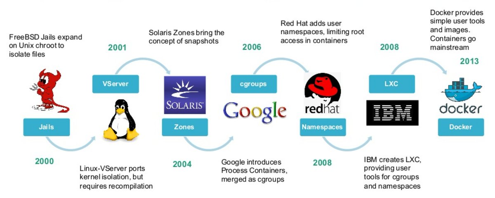
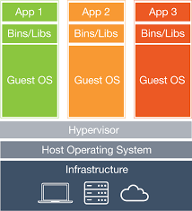
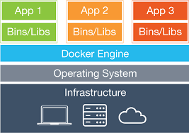

# Docker

## do VE not VM

<!--s-->

### Un poco de historia



<!--s-->

### Máquina virtual vs. Contenedor

| VM | Docker |
| :---: | :---: |
|  |  |

<!--v-->

### Diferencias

| VM | Docker |
| --- | --- |
| Hypervisor | containerd o LXC |
| OS independiente | Comparte kernel |
| Emulación de HW | namespaces y cgroups |

<!--s-->

### Anatomía de una imagen


<!--s-->

### Mi primera imagen

```
$ docker run -i -t debian:buster-slim bash
  # apt-get update
  # apt-get install -y figlet
  # exit
$ docker commit $(docker ps -l -q) pinino:by-commit
```
<!--v-->

### El huevo y la gallina

* La única manera de hacer un contenedor es instanciando una imagen.
* La única manera de hacer una imagen es _freezeando_ un contenedor.

* Existe una imagen especial llamada *scratch* con la que podemos iniciar una imagen desde cero (este es un conocimiento 0.01% necesario).

`FROM scratch...`

<!--s-->

### Mi segunda imagen

```
FROM debian:buster-slim
RUN apt-get update && \
    apt-get install figlet
CMD ["figlet", "hola"]
```

`$ docker build -f Dockerfile -t pinino:dockerfile .`

<!--v-->

### Comandos para interactuar con contenedores

```
$ docker create   # crear un contenedor sin iniciarlo
$ docker run      # crear e iniciar un contenedor
$ docker stop     # detener un contenedor
$ docker start    # iniciar un contenedor
$ docker restart  # reinciar un contenedor
$ docker rm       # eliminar un contenedor
$ docker kill     # enviar señal SIGKILL a un contenedor
$ docker exec     # ejecutar en un contenedor
$ docker attach   # conectar stdin, stdout, stderr a un contenedor
$ docker wait     # bloquear hasta terminar de ejecutar un contenedor

$ docker ps       # muestra contenedores activos
$ docker inspect  # muestra información de un contenedor
$ docker logs     # muestra logs del contenedor
$ docker events   # muestra eventos del contenedor
$ docker port     # muestra mapeos de puertos
$ docker top      # muestra procesos corriendo dentro del contenedor
$ docker diff     # muestra diferencias en el FS del contenedor
$ docker stats    # muestra estadísticas del contenedor
```
<!--s-->

### Docker compose

Es una herramienta que se utiliza un archivo de configuración YAML para definir los servicios que conforman una aplicación.

<!--v-->

### Demo

#### Aplicación de tres capas

<!--s-->

### Persistencia

* Los contenedores por defecto ocupan almacenamiento efímero.
* Para persistir el estado de un contenedor es necesario hacer uso de volúmenes.

Sin volúmenes
```
$ docker run --rm -d -p 33060:3306 --name DB-olvidadiza -e MYSQL_ROOT_PASSWORD=root mysql:5
```

Con volúmenes
```
$ docker run --rm -d -v $(pwd)/mysql-data:/var/lib/mysql -p 33060:3306 --name DB-persistente -e MYSQL_ROOT_PASSWORD=root mysql:5
```
<!--s-->

### Networking

#### Básico

* **Bridge**
  Default. Utiliza una red virtual generada por Docker al iniciar el demonio.

* **Host**
  En este modo no existe una red virtual y se utilizan directamente las capacidades de networking del _host_

* **None**
  Es posible aislar un contenedor para que no tenga capacidades de _networking_.

<!--v-->

### Avanzada

* **Overlay**
  Utiliza una red virtual compartida por varios _hosts_.

* **Macvlan**
  Legacy. Permite asignar una dirección MAC para los contenedores y que sirve para lidiar con aplicaciones que requieren una conexión directa a la red física.

<!--s-->

### Siguientes pasos

* Docker Hub
* Docker Swarm
* CoreOS
* Kubernetes

<!--v-->

### ¡Gracias!

### ¿Preguntas?
